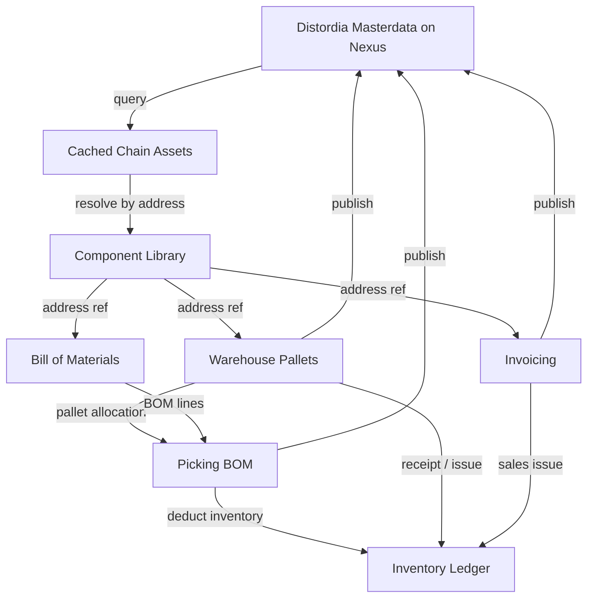
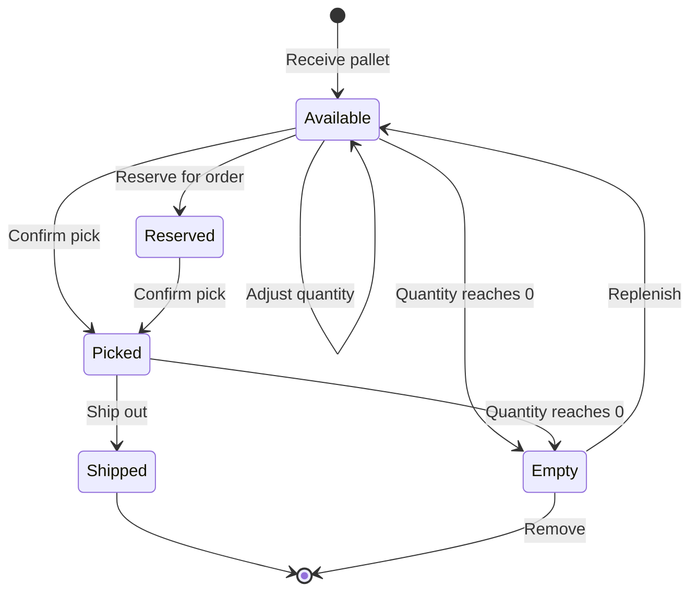
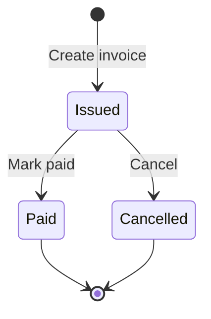
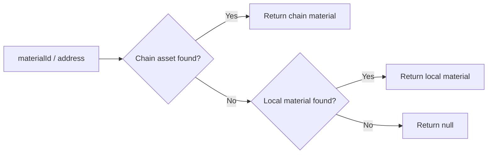

# Chain Assets Architecture — Distordia Masterdata as Layer 0

## Overview

The Distordia masterdata on the Nexus blockchain serves as the **Layer 0** foundation of the supply chain.  Every component/material is defined once as a `material_master_data` asset with a unique on-chain address (the "art.nr" / reference number).

The MRP module **never duplicates** masterdata.  The internal component library stores only asset addresses.  All descriptive data (name, unit, cost, type …) is resolved at query time from the cached chain assets.

## Data Flow — Address-Only References



## Component Library — Zero Duplication

When a user searches Distordia masterdata and adds a component to their library the Redux state stores only:

```json
{
  "componentLibrary": [
    { "address": "a1b2c3d4e5...", "addedAt": "2026-02-18T12:00:00Z" },
    { "address": "f6g7h8i9j0...", "addedAt": "2026-02-18T12:05:00Z" }
  ]
}
```

No name, no unit, no cost — just the address.  The `resolveLibrary()` helper resolves each address against `chainAssets` to produce full material objects at render time.

## Pallet Lifecycle



Pallets store only `materialId` (the Distordia asset address), `quantity`, `location`, and `status`.  Material name and unit are resolved from the chain at display time.

## Invoice Lifecycle



Invoice line items reference the Distordia address as `materialId`.  The invoice also snapshots `materialName` and `unitPrice` for archival (invoices are legal documents), but the canonical reference remains the address.

## Material Resolution Order

All components follow the same resolution logic (see `materialReferenceManager.js`):

1. **Chain asset by address** — authoritative (Distordia masterdata / Layer 0)
2. **Local material by ID** — offline / legacy fallback



## Redux State Structure

```
state.mrp
  chainAssets: []             ← Cached chain assets (full parsed data)
  componentLibrary: []        ← Address-only references to masterdata
  materials: []               ← Local-only materials (legacy / offline)
  inventory: {}               ← Keyed by asset address or material ID
  bom: {}                     ← Parent→children, keyed by address
  pallets: []                 ← Each pallet has materialId = address
  invoices: []                ← Each line item has materialId = address
  activeTab: 'search'
```

## Distordia_Standards Asset Types

| Asset Type             | Name Prefix      | Purpose                                    |
|------------------------|------------------|--------------------------------------------|
| `material_master_data` | `mrp_material_`  | Layer 0 — global component catalog          |
| `warehouse_pallet`     | `mrp_pallet_`    | Physical pallet inventory                   |
| `sales_invoice`        | `mrp_invoice_`   | Issued sales invoice                        |
| `picking_list`         | `mrp_picklist_`  | BOM-based picking list                      |

All asset types include a `distordia` field (1–5) for lifecycle status and an `assetType` field for identification.  The `materialId` field in pallets, invoices, and picking lists always refers to the Distordia masterdata asset address.

## Benefits

1. **Single source of truth** — Distordia masterdata is the canonical reference
2. **Zero duplication** — no material data copied into local state
3. **Always current** — masterdata updates are immediately visible
4. **Interoperable** — any system following Distordia_Standards can read the same assets
5. **Auditable** — every transaction traces back to a chain address
6. **Offline fallback** — local materials still work when disconnected
