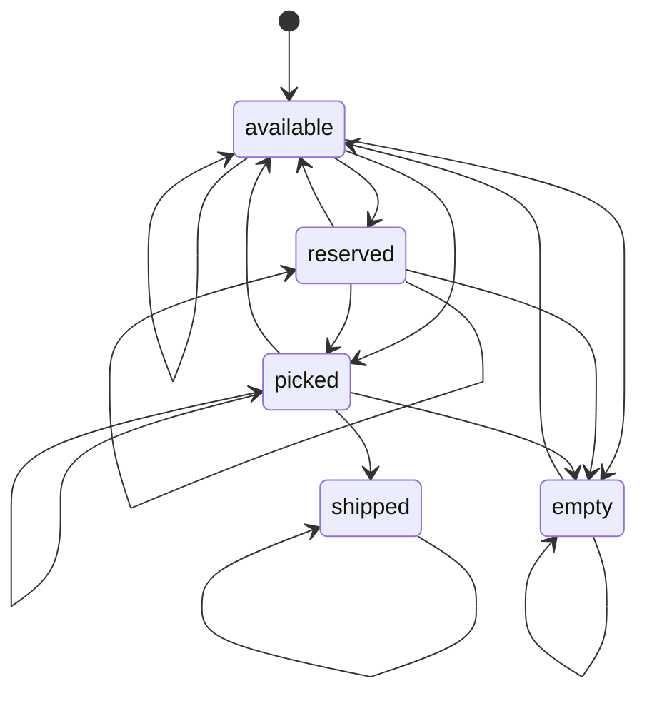
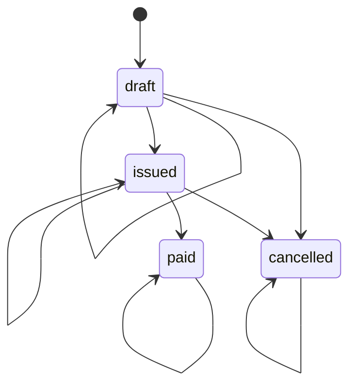
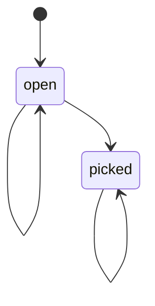

# App State Machines

This document defines the finite state machines used by the MRP app.

## 1) Pallet Lifecycle Machine

States:

- `available`
- `reserved`
- `picked`
- `shipped`
- `empty`

Operational mapping:

- Receive pallet: `[*] -> available`
- Quantity adjust to zero: `* -> empty`
- Replenish empty pallet: `empty -> available`
- Pick and consume partially: `available -> available`
- Pick and consume fully: `available -> empty`

## 2) Invoice Lifecycle Machine

States:

- `draft`
- `issued`
- `paid`
- `cancelled`

Operational mapping:

- Current UI creates invoices directly as `issued`.
- `Mark Paid` enforces `issued -> paid` only.

## 3) Picking List Lifecycle Machine

States:

- `open`
- `picked`

Operational mapping:

- Generate picking list: `[*] -> open`
- Confirm pick: `open -> picked`
- Confirm pick is blocked when shortfall exists.

## 4) App Navigation Machine (Tabs)

The active UI tab is also a simple machine with these states:

- `search`
- `warehouse`
- `inventory`
- `bom`
- `picking`
- `invoicing`
- `planning`

Every tab can transition to every other tab through `SET_ACTIVE_TAB`.

## 5) Validation Rule

Every status update should follow the machine transition rules:

`currentState -> nextState` must be listed as a valid transition in this document.

If not valid, the transition should be rejected in UI/business logic.
